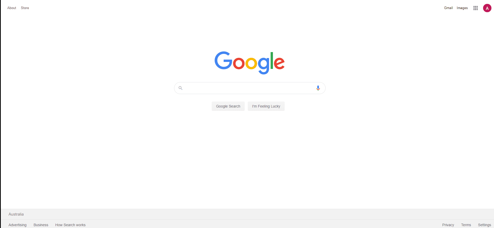

# Cypress Automation

A simple Javascript project to demonstrate power of Cypress

 

* HTML Report with screenshots - Using mochawesome
* Configuration Driven Tests - Using cypress.json
* Test cases to demonstrate browser interactions using cypress, assertions etc.

 **Mochawesome Report - Passed**

 **Mochawesome Report - Failed With Screenshots**

